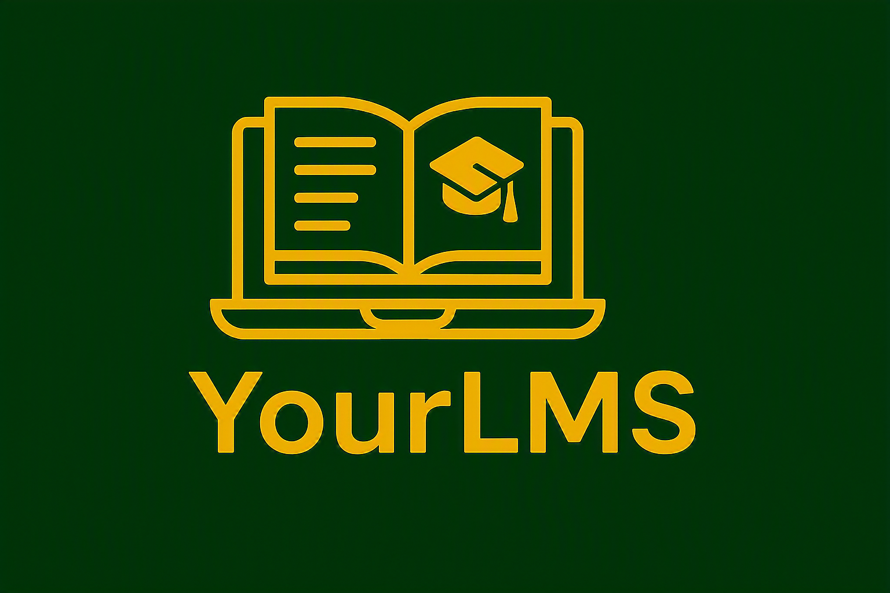
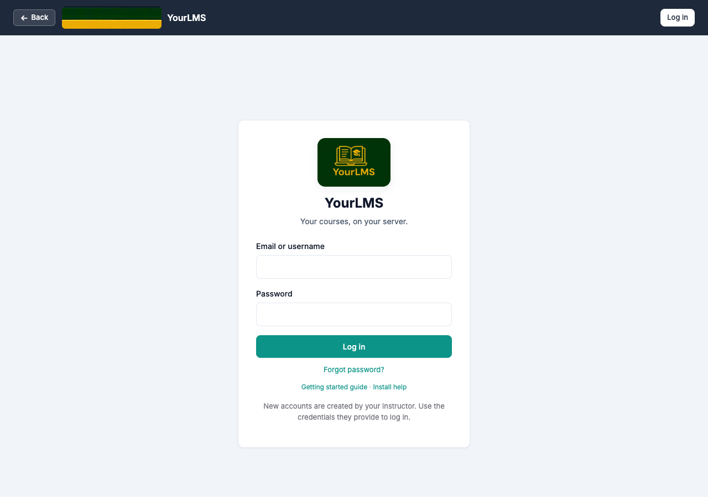
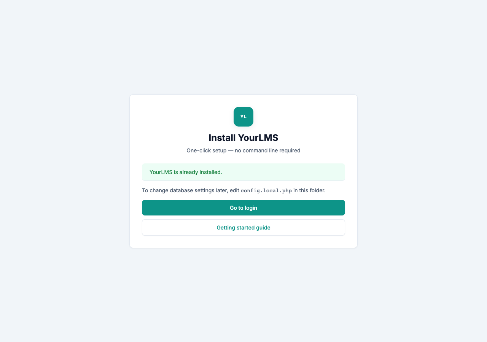
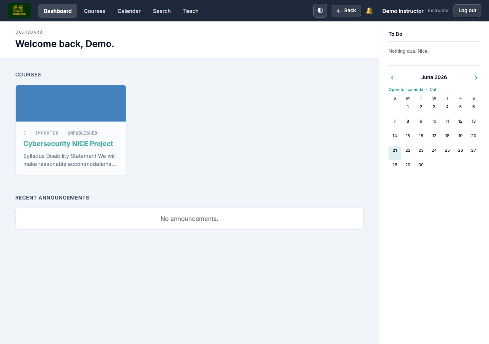
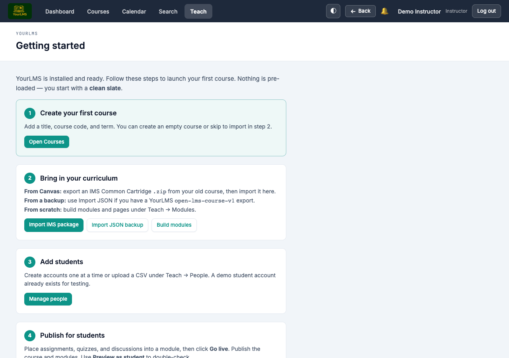
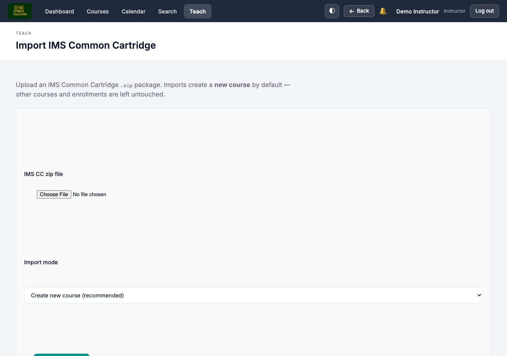

<p align="center">
  <a href="https://github.com/kenneth-nnadi/yourlms">
    
  </a>
</p>

<h1 align="center">YourLMS</h1>

<p align="center">
  <strong>A free, self-hosted learning management system — install in minutes, no command line required.</strong>
</p>

<p align="center">
  Import a Canvas course, build modules, grade assignments, and keep teaching when cloud platforms are down.
</p>

<p align="center">
  <a href="https://github.com/kenneth-nnadi/yourlms">github.com/kenneth-nnadi/yourlms</a> · MIT License
</p>

<p align="center">
  
</p>

---

## Why we built this

In early 2026, a major cyber incident disrupted **Instructure** (the company behind Canvas) and affected **Canvas for Teachers** — the free tier used by educators worldwide — along with many international schools that relied on it every day.

Among the programs hit was the **NICE cybersecurity curriculum** used to train high school teachers. We lost not only years of course materials but also access to the platform that held them.

When the **Oregon NICE Teachers Summer Workshop** came around in 2026, we still had teachers in the room and a program to deliver — but no Canvas. We needed something that worked locally, under our control, and on short notice.

**Kenneth Nnadi** and **Dan Carrere** built YourLMS as that alternative. We are open-sourcing it so any educator can:

- Install their own LMS **free of charge**
- Host curriculum on hardware they control
- Import existing Canvas IMS exports
- Keep teaching when SaaS platforms are unavailable

You start with a **clean slate** — no pre-loaded courses. Import yours or build from scratch.

---

## Choose how to install

| Method | Best for | Guide |
|--------|----------|-------|
| **XAMPP** | Teachers, Windows/Mac, no terminal | [Below](#xampp-easiest) · [INSTALL.md](INSTALL.md) |
| **Docker** | Developers, Linux servers, reproducible stacks | [docs/docker.md](docs/docker.md) |
| **Manual (LAMP / nginx)** | Existing PHP + MySQL server | [docs/install-manual.md](docs/install-manual.md) |
| **Shared hosting** | Cheap web host, no MySQL | `install.php` · [INSTALL.md](INSTALL.md#shared-hosting-no-mysql) |

---

## XAMPP (easiest)

Designed for **non-technical users**. No terminal commands required.

<p align="center">
  
</p>

1. **Download** this folder and place it in XAMPP’s `htdocs` as `yourlms`  
   (e.g. `C:\xampp\htdocs\yourlms` or `/Applications/XAMPP/xamppfiles/htdocs/yourlms`)

2. **Start** Apache and MySQL in the XAMPP control panel.

3. **Open** `http://localhost/yourlms/setup.php` — enter database details (XAMPP defaults are pre-filled), click **Install now**.

Setup configures **up to 1 GB** course imports automatically. See [INSTALL.md](INSTALL.md) for troubleshooting.

---

## Docker

Requires [Docker Desktop](https://www.docker.com/products/docker-desktop/) or Docker Engine + Compose.

```bash
git clone https://github.com/kenneth-nnadi/yourlms.git
cd yourlms
bash deploy/debian-home/setup.sh
```

Then open **http://localhost:8080/** and log in. Full details: **[docs/docker.md](docs/docker.md)**.

---

## Manual install (no XAMPP)

If you already run Apache/nginx, PHP, and MySQL on Linux or macOS:

1. Clone or copy YourLMS into your web root
2. Create a MySQL database and user
3. Open **`/yourlms/setup.php`** in the browser and complete the wizard

Step-by-step for Debian/Ubuntu, Homebrew, nginx, and Windows alternatives: **[docs/install-manual.md](docs/install-manual.md)**.

---

## Screenshots

| Setup wizard | Dashboard |
|:---:|:---:|
|  |  |

| Getting started | Import Canvas course |
|:---:|:---:|
|  |  |

---

## After install

| Step | What to do |
|------|------------|
| 1 | Log in as instructor (`instructor@yourlms.test` / `password123`) |
| 2 | Open **Getting started** from the dashboard or Teach menu |
| 3 | Import your Canvas `.zip` (**Teach → Import IMS**) or create a course manually |
| 4 | Add students under **Teach → People** |
| 5 | Publish modules and use **Preview as student** |

Optional later: [custom domain & SSL](docs/ssl-and-domain.md)

---

## Demo accounts

| Email | Role | Password |
|-------|------|----------|
| `instructor@yourlms.test` | Site instructor | `password123` |
| `student@yourlms.test` | Student | `password123` |

**Change these before sharing your server with anyone.**

---

## Features

- Courses, modules, pages, files, assignments, quizzes, discussions
- Canvas-style **Go live** publishing and student preview
- IMS Common Cartridge import + JSON/ZIP backup/restore
- Gradebook, rubrics, weighted assignment groups
- In-app notifications (optional SMTP email)
- Mobile-friendly UI and threaded discussions
- API tokens for course/grade export

---

## Documentation

| Guide | Description |
|-------|-------------|
| [INSTALL.md](INSTALL.md) | XAMPP step-by-step for non-technical installers |
| [docs/docker.md](docs/docker.md) | Docker install and daily commands |
| [docs/install-manual.md](docs/install-manual.md) | Linux, Homebrew, nginx, shared hosting |
| [docs/deployment.md](docs/deployment.md) | Production checklist and backups |
| [docs/publishing.md](docs/publishing.md) | How students see your content |
| [docs/ssl-and-domain.md](docs/ssl-and-domain.md) | HTTPS and custom domain (optional) |
| [docs/architecture.md](docs/architecture.md) | Technical overview |
| [CONTRIBUTING.md](CONTRIBUTING.md) | For developers |
| [SECURITY.md](SECURITY.md) | Report vulnerabilities |

---

## Requirements

- PHP 8.1+ (`mbstring`, `zip`, `pdo_mysql` or `pdo_sqlite`)
- MySQL/MariaDB (XAMPP, Docker, manual) **or** SQLite (shared hosting)
- Apache, nginx, or Caddy

---

## Credits

Created for the **Oregon NICE Teachers Summer Workshop**, 2026 — when educators needed to keep teaching without the cloud.

**Kenneth Nnadi** · **Dan Carrere** · open-source contributors

## License

MIT — see [LICENSE](LICENSE).